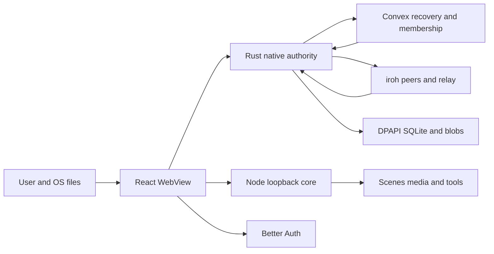

# NetsuBoard threat model

## Executive summary

NetsuBoard is a Windows desktop application with three security-critical network surfaces: a
loopback Node control service, an authenticated Convex deployment, and iroh peer connections. The
highest-value assets are local media paths/bytes, collaborative plaintext, durable CRDT integrity,
device/project keys, and OAuth sessions. The implementation strongly separates these responsibilities:
Rust owns collaboration secrets and validation, Convex enforces current membership around sealed
recovery objects, iroh authenticates peer keys, and local media enters through one-use native grants.
The most important residual risks are a compromised trusted renderer inheriting pre-existing desktop
capabilities, delayed revocation during a Convex outage, data already retained by a former member, and
quota/storage abuse by a legitimate writer.

## Scope and assumptions

In scope:

- native shell and collaboration: `src-tauri/src/lib.rs`, `src-tauri/src/collab/`;
- renderer collaboration, scene integration, and account UI: `src/lib/collab/`,
  `src/components/reference/`, `src/components/settings/CollabSection.tsx`;
- identity/recovery backend: `convex/`;
- loopback Node service and scene metadata: `core/server.js`, `core/rpc.js`,
  `core/httpSecurity.js`, `core/reference.js`;
- relevant configuration and packaging: `src-tauri/tauri.conf.json`, `package.json`,
  `src-tauri/Cargo.toml`, `.github/workflows/ci.yml`.

Out of scope: vulnerabilities inside unmodified upstream ffmpeg, mpv, WebView2, yt-dlp, Tauri,
Convex, iroh, Loro, or cryptographic libraries; administrator/physical compromise of Windows; and
unreachable NetsuRush modules. Their integration boundaries remain in scope.

Assumptions previously confirmed with the product owner:

- this is an internet-connected Windows desktop product for 2–15 invited collaborators per project;
- Discord/Better Auth identifies accounts, Convex is the public membership/recovery service, and
  peers may connect directly or through iroh relays;
- collaborators are ordinary trusted creative partners, not mutually hostile Byzantine tenants;
- board content and local media may be private, but the product is not intended for regulated secret
  material or hostile multi-tenant isolation;
- the renderer must see plaintext to render it, while raw project/device keys must remain native;
- offline editing is required; revocation during a backend outage may be delayed but server publication
  and key rotation must fail closed.

Open questions that can change risk ranking: the production Convex deployment's monitoring/retention
configuration, whether telemetry will alert on storage/egress anomalies, and results from the required
two-machine runtime validation. These are operational unknowns, not missing product decisions.

## System model

### Primary components

- **React/WebView2 renderer:** board UI, Better Auth token acquisition, typed operation submission,
  and total native projection. Evidence: `src/App.tsx`, `src/lib/collab/client.ts`,
  `src/components/reference/useCollabProject.ts`.
- **Tauri/Rust shell:** privileged commands, device/key protection, Loro authority, SQLite outbox,
  Convex HTTP client, iroh endpoint, blob store, and custom media protocol. Evidence:
  `src-tauri/src/lib.rs::run`, `src-tauri/src/collab/service.rs::run_actor`.
- **Node core:** loopback RPC/SSE, scene metadata, solo-board media and external tool orchestration.
  Evidence: `core/server.js`, `core/rpc.js::createRpc`, `core/reference.js::createReferenceStore`.
- **Convex/Better Auth:** public authentication, friendship/invitations, membership/RBAC, proved
  devices, wrapped keys, sealed heads/checkpoints, upload receipts, inbox, and media requests.
  Evidence: `convex/schema.ts`, `convex/projects.ts`, `convex/devices.ts`, `convex/heads.ts`.
- **iroh network/relay:** authenticated QUIC for signed Loro updates and hash-addressed media chunks.
  Evidence: `src-tauri/src/collab/net.rs`, `src-tauri/src/collab/blobs.rs`.
- **Local stores:** DPAPI identity/key files, project SQLite/WAL, Loro snapshots, blob store, and Node
  scene database under the application home. Evidence: `src-tauri/src/collab/identity.rs`,
  `src-tauri/src/collab/store.rs`, `core/reference.js`.

### Data flows and trust boundaries

- **User/OS → renderer/native picker:** file selections, drops, text, board gestures; WebView2/IPC.
  Native selection produces random one-use grants; typed operations reject unknown fields and invalid
  bounds. Evidence: `src-tauri/src/lib.rs::nr_pick_trusted_files`,
  `src-tauri/src/collab/ops.rs::OperationBatch::validate`.
- **Renderer → Rust:** JWTs and high-level project operations over Tauri IPC. Tauri origin/CSP applies;
  Rust validates ids, role, schema, paths, and document invariants. Keys and peer choice do not cross
  back. Evidence: `src-tauri/src/collab/commands.rs`, `src-tauri/tauri.conf.json`.
- **Renderer → Node core:** JSON RPC and SSE on loopback HTTP. Host and Origin must be Tauri/loopback;
  RPC requires `application/json`, a 128 MiB body ceiling, an own handler key, and channel validation.
  Evidence: `core/httpSecurity.js::controlRequestAllowed`, `core/rpc.js::handle`.
- **Rust → Convex:** short-lived bearer JWT over HTTPS to the configured deployment. Every project
  function authenticates and checks membership/role; device publications require a proof-registered
  key and current epoch. Evidence: `src-tauri/src/collab/convex.rs::AuthSession`,
  `convex/heads.ts::requireMember`.
- **Rust peer → Rust peer:** authenticated iroh QUIC. Endpoint allowlist, project roster/writer bit,
  ALPN version, Ed25519 frame signature, length bounds, and timeouts apply. Evidence:
  `src-tauri/src/collab/net.rs::accept_loop`, `read_update_frame`,
  `src-tauri/src/collab/crypto.rs::SealedEnvelope`.
- **Peer → blob store:** declared hash/size plus bounded chunks. Project reference authorization,
  per-chunk and final BLAKE3, resume offset, and size ceiling apply. Evidence:
  `src-tauri/src/collab/net.rs::fetch_blob`, `src-tauri/src/collab/blobs.rs::finish`.
- **Convex storage → Rust:** ciphertext plus authenticated header/signature. Rust downloads only after
  membership-scoped queries, verifies signature/hash/AEAD, and merges through Loro. Evidence:
  `src-tauri/src/collab/service.rs::open_remote_payload`, `convex/heads.ts::listHeads`.

#### Diagram

## Assets and security objectives

| Asset | Why it matters | Security objective (C/I/A) |
|---|---|---|
| Collaborative board plaintext | Private creative work; unauthorized disclosure harms users | C, I |
| Loro history, SQLite outbox, checkpoints, heads | Losing or forging an accepted branch corrupts shared work | I, A |
| Device Ed25519 and X25519 secrets | Authenticate a device and unwrap future project epochs | C, I |
| Project epoch keys | Decrypt all content for that epoch | C, I |
| Better Auth session/JWT | Grants account-scoped backend access | C, I |
| Membership, roles, invitations | Defines who may read, write, invite, remove, or delete | I, A |
| Local file paths and original media | May expose unrelated private filesystem content | C, I |
| Convex storage/quota | Required for offline recovery; exhaustion can block publication | A |
| iroh endpoint availability | Required for low-cost live sync and original-media delivery | A |
| Installer/update artifacts | Compromise yields code execution as the current Windows user | I, C |

## Attacker model

### Capabilities

- unauthenticated internet attacker reaching public OAuth/Convex HTTP surfaces;
- authenticated account that can send friend requests or receive an invitation;
- authorized viewer/editor sending malformed renderer, Convex, or P2P input under their own identity;
- remote iroh endpoint sending arbitrary frames before/after authorization attempts;
- malicious website attempting browser-to-loopback requests while NetsuBoard runs;
- malicious/corrupt `.netsu`, media file, URL metadata, encrypted head, or chunk;
- network observer or relay able to observe endpoints, timing, and ciphertext sizes;
- former member retaining material legitimately decrypted before revocation.

### Non-capabilities

- no administrator, physical, or same-user arbitrary-process access to the victim machine;
- no ability to extract DPAPI secrets without compromising the Windows account/process;
- no assumed compromise of Convex, Better Auth, Windows cryptography, maintained crypto crates, or
  code-signing keys;
- no promise to prevent a legitimate writer from making valid but unwanted artistic changes;
- no expectation that revocation erases screenshots, exports, old plaintext, or keys already received.

## Entry points and attack surfaces

| Surface | How reached | Trust boundary | Notes | Evidence (repo path / symbol) |
|---|---|---|---|---|
| Tauri collaboration commands | WebView `invoke` | Renderer → privileged Rust | High-level typed commands; no raw key/peer/path primitives | `src-tauri/src/collab/commands.rs` |
| Custom `collab` media scheme | WebView GET/HEAD | Renderer → native blob store | Trusted renderer origin, active project lease, project id/hash only, current reference, and range bounds | `src-tauri/src/collab/blobs.rs::protocol_response` |
| Native picker and OS drop | User gesture/WebView2 | OS file system → Rust | Canonical regular file plus random one-use grant | `src-tauri/src/lib.rs::nr_pick_trusted_files` |
| Node `/rpc` and `/events` | Loopback HTTP | Browser/WebView → Node | Exact local origins/Host; JSON and size bound | `core/server.js`, `core/rpc.js` |
| OAuth deep link | System browser/custom scheme | Internet browser → app session | One-time token and single-instance handoff | `src/lib/deepLink.ts`, `src-tauri/src/lib.rs` |
| Convex public functions | HTTPS | Internet/account → backend | Better Auth, indexed membership/RBAC, caps | `convex/projects.ts`, `convex/heads.ts` |
| Device registration | Convex mutation | Account session → device registry | Short-lived challenge, Ed25519 proof, and durable forgotten-identity tombstone | `convex/devices.ts::registerDevice` |
| Recovery file upload | Convex upload URL | Writer → public storage | 32 MiB client/server bound; retained/deleted only with ownership receipt | `convex/heads.ts::registerPayloadUpload` |
| iroh sync ALPN | QUIC direct/relay | Remote device → Rust | Endpoint/project writer checks, signature, frame limit, timeout | `src-tauri/src/collab/net.rs` |
| iroh blob ALPN | QUIC direct/relay | Remote device → local disk | Referenced hash, resumable bounded chunks, full verification | `src-tauri/src/collab/net.rs::serve_blob` |
| Loro/import decoding | Local/remote bytes | Untrusted serialized data → document | Version, limits, total batch validation, AEAD/signature first | `src-tauri/src/collab/doc.rs`, `ops.rs` |
| Convex environment/release | Operator/CI | Maintainer → production | Secrets external; deployment and updater keys are high impact | `docs/convex-setup.md`, `docs/releasing.md` |

## Top abuse paths

1. **Steal unrelated local media:** compromise the renderer, submit a guessed path, import it, then
   exfiltrate through a project. Collaboration blocks this with native picker/drop grants, canonical
   regular-file checks, scene/app-asset fallback confinement, and hash-only manifests; impact remains
   through the broader pre-existing asset scope if the renderer is already compromised.
2. **Publish after removal:** retain an old project key and valid account session, then publish an old
   epoch head. Convex rechecks the membership row, proved device, writer role, rotation flag, and
   current key epoch before every retained head. A forgotten identity is tombstoned before its active
   device row is removed, so the normal client cannot silently register it again.
3. **Race compaction to erase a branch:** replace a device head while another device compacts the
   observed set. Checkpoint CAS compares the checkpoint epoch and exact head revisions; the mutation
   conflicts instead of deleting the changed head.
4. **Delete another subsystem's Convex file:** pass an arbitrary storage id to cleanup. Cleanup now
   requires a `projectPayloadUploads` receipt bound to the caller and project; publication additionally
   binds it to the proved device and exact size.
5. **Browser-to-loopback confused deputy:** host a page that POSTs dangerous RPC channels to
   `127.0.0.1`. The Node control plane rejects non-loopback Host, non-Tauri/non-loopback Origin,
   non-JSON content, oversized bodies, and inherited handler names.
6. **Peer memory/disk exhaustion:** connect through a relay and send huge or endless frames/chunks.
   ALPNs are versioned, frames/chunks are bounded, every exchange times out, partials have TTL, and
   final size/hash must match before promotion.
7. **Offline revocation bypass:** continue direct P2P edits while Convex is unreachable and the device
   still appears in the last signed roster. This is a deliberate availability tradeoff; revocation is
   enforced after connectivity returns and new durable server publication remains blocked.
8. **Exhaust the free Convex team:** repeatedly publish heads, request missing media, or abandon file
   uploads. Debounce/backoff, one head/device, bounded rows, notification coalescing, reservations, and
   no original media reduce impact; an authorized writer can still consume calls and abandon a raw
   upload before registration.
9. **Read old work after revocation:** use plaintext/key material legitimately retained before removal.
   Epoch rotation protects future content only; no implementation can remotely erase prior exports or
   screenshots.

## Threat model table

| Threat ID | Threat source | Prerequisites | Threat action | Impact | Impacted assets | Existing controls (evidence) | Gaps | Recommended mitigations | Detection ideas | Likelihood | Impact severity | Priority |
|---|---|---|---|---|---|---|---|---|---|---|---|---|
| TM-001 | Malicious website | NetsuBoard core running; victim visits attacker page | Invoke loopback RPC as a confused deputy | Local state mutation, tool execution, information exposure | Files, compute, board integrity | Host/Origin gate and JSON/body/own-key validation (`core/httpSecurity.js`, `core/rpc.js`) | Local-origin applications and non-browser same-user clients remain trusted | Keep origin tests; consider per-launch native token once every renderer/integration can receive it reliably | Log refused Origin/Host without sensitive body | Low | High | medium |
| TM-002 | Removed/revoked collaborator | Was authorized; Convex unavailable; cached roster still valid locally | Attempt P2P reads/writes before roster refresh | Temporary unauthorized edits, delayed revocation | Board integrity, membership | 30 s online refresh, signed cached roster, current-epoch encryption inside QUIC, publish-time server RBAC, epoch rotation (`service.rs::InboundUpdate`, `net.rs`, `convex/heads.ts`) | Outage can extend acceptance of old-epoch traffic until rotation completes | Show explicit offline-security state; optionally offer owner-controlled fail-closed offline mode | Count cached-roster accepts and publish authorization failures | Medium | Medium | medium |
| TM-003 | Compromised renderer | WebView script execution or dependency compromise | Read visible plaintext and invoke desktop capabilities | Board/media disclosure; local actions | Plaintext, local files | CSP, typed native commands, native keys, one-use collaboration grants (`tauri.conf.json`, `commands.rs`, `blobs.rs`) | Pre-existing asset protocol scope is broad; renderer must see plaintext | Replace broad asset scope with dynamic native allowlisting in a dedicated hardening project | CSP violation reports; unexpected asset/RPC access telemetry | Low | High | medium |
| TM-004 | Malicious/buggy peer | Authorized or attempts an iroh connection | Send forged, oversized, corrupt, repeated, or slow frames | DoS or invalid document/media bytes | Availability, document integrity, disk | QUIC identity, allowlists, writer role, signed v1 frame, caps/timeouts, chunk/final hashes (`net.rs`, `blobs.rs`) | No persistent peer failure scoring; valid writer can send costly valid changes | Add per-peer error counters and temporary backoff after runtime measurement | Structured counts for rejected frames, timeouts, hash mismatches | Medium | Medium | medium |
| TM-005 | Renderer/file attacker | Attempts arbitrary path, symlink/junction, replay, or guessed grant | Import unrelated local file into shared blob store | Local file disclosure | Local paths/media | Native picker/drop, 256-bit one-use 15 min grants, canonical regular files, scene/app confinement (`lib.rs`, `blobs.rs::consume_import_grant`) | Windows short-name/junction behavior needs live adversarial testing | Add Windows integration tests for junction and 8.3 aliases on CI hardware | Log grant refusal category without paths | Low | High | medium |
| TM-006 | Authorized writer | Editor account and valid device | Consume function/storage quota or abandon uploads | Recovery unavailable on Free tier | Convex quota, project availability | Debounce/backoff, caps, one head/device, upload ownership receipt, coalesced inbox/media (`service.rs`, `schema.ts`) | Raw generated upload can be abandoned before receipt; no Byzantine quota | Monitor file storage and set usage alerts; add expiring upload permits if abuse appears | Alerts on upload URL/receipt mismatch, storage growth, calls/user | Medium | Medium | medium |
| TM-007 | Former collaborator | Previously received plaintext or an old epoch key | Retain/read/export old content after removal | Historical confidentiality loss | Old board plaintext/media | Rotation blocks future epochs and publications; bounded audit records removal and rotation (`heads.ts::commitKeyRotation`, `audit.ts`) | Retroactive erasure impossible | Set user expectations; use new project for exceptionally sensitive future work | Review membership and rotation audit events | High | Medium | medium |
| TM-008 | Account/device attacker | Steals Better Auth token or DPAPI-unlocked process context | Register/use device, fetch envelopes, publish as victim | Project disclosure and integrity loss | JWT, device keys, project keys | Short-lived JWT refresh, challenge proof, five-device cap, durable revoked-identity tombstone, DPAPI, current-role checks (`authBridge.ts`, `devices.ts`, `identity.rs`) | A stolen account session can enrol a brand-new identity; device forgetting is not global account-session revocation | Offer session review/revocation and alerts; consider re-auth for destructive owner actions | Notify on new/revoked device and unusual project access | Low | High | medium |
| TM-009 | Network/relay observer | Can observe Convex/iroh traffic but not endpoints' secrets | Correlate project activity, members, sizes, requested hashes | Metadata privacy loss | Relationship/activity metadata | TLS/QUIC, sealed content, original media bypasses Convex (`convex.rs`, `net.rs`) | Traffic analysis and server-visible membership are inherent | Document metadata exposure; avoid adding plaintext project names or filenames to notices | Periodic schema review for new plaintext fields | Medium | Low | low |
| TM-010 | Supply-chain/release attacker | Dependency, CI, signing, or release credential compromise | Ship malicious update or vulnerable dependency | Code execution for all updating users | All assets, signing trust | Locked npm/Cargo deps, signed updater process, CSP, dependency audit (`package-lock.json`, `Cargo.lock`, `docs/releasing.md`) | Runtime dependency behavior and CI protections require separate review | Enable dependency alerts, protect release/signing credentials, verify artifacts and provenance | Alert on lockfile/updater-key changes and unexpected release assets | Low | High | medium |

Risk is most sensitive to the trusted-collaborator assumption. Treating invited editors as hostile
multi-tenant adversaries would raise TM-004 and TM-006 to high and require per-user rate/storage quotas,
moderation, audit logs, and possibly a server-mediated protocol.

## Criticality calibration

- **Critical:** unauthenticated internet or update-chain compromise reliably yielding arbitrary code
  execution or cross-project key/plaintext extraction for many users. Examples: updater signing-key
  compromise; pre-auth Convex function returning every project's key envelope plus usable recipient
  secrets.
- **High:** practical single-user key/media exfiltration, membership bypass, or silent permanent loss of
  acknowledged collaborative branches. Examples: arbitrary local file import through a renderer
  argument; checkpoint CAS deleting an unmerged head; removed account publishing current-epoch work.
- **Medium:** bounded targeted DoS, temporary authorization delay, or disclosure requiring an invited
  member/renderer compromise. Examples: Free-tier quota exhaustion by an editor; cached-roster writes
  during a backend outage; malicious peer causing repeated bounded retries.
- **Low:** metadata exposure or noisy failures with limited user harm and easy recovery. Examples: relay
  learning transfer sizes; a non-member learning that an opaque project id is invalid; duplicate
  consolidated activity wording.

## Focus paths for security review

| Path | Why it matters | Related Threat IDs |
|---|---|---|
| `src-tauri/src/collab/service.rs` | Central authorization, recovery, rotation, publication, and lifecycle state machine | TM-002, TM-004, TM-006, TM-008 |
| `src-tauri/src/collab/net.rs` | Remote authenticated parser and P2P admission boundary | TM-002, TM-004, TM-009 |
| `src-tauri/src/collab/blobs.rs` | Local path grants, network chunks, custom protocol, and GC | TM-003, TM-004, TM-005 |
| `src-tauri/src/collab/crypto.rs` | Epoch keys, AEAD, signatures, and HPKE envelopes | TM-007, TM-008 |
| `src-tauri/src/collab/identity.rs` | DPAPI secret lifecycle and device identity persistence | TM-008 |
| `src-tauri/src/collab/store.rs` | Crash consistency and exact encrypted outbox | TM-006 |
| `src-tauri/src/collab/doc.rs` | Untrusted Loro import, schema migration, and convergence | TM-004 |
| `src-tauri/src/collab/ops.rs` | Renderer/untrusted input bounds and URL/media validation | TM-003, TM-005 |
| `convex/heads.ts` | Server RBAC, head/checkpoint CAS, upload receipts, key rotation | TM-002, TM-006, TM-008 |
| `convex/devices.ts` | Proof registration and device revocation | TM-008 |
| `convex/projects.ts` | Invitations, roles, membership lifecycle, destructive deletion | TM-002, TM-007 |
| `convex/schema.ts` | Index, cardinality, and plaintext/ciphertext boundary | TM-006, TM-009 |
| `convex/audit.ts` | Bounded evidence for destructive membership, device, key, and stale-head decisions | TM-002, TM-007, TM-008 |
| `core/httpSecurity.js` | Browser-to-loopback trust decision | TM-001 |
| `core/rpc.js` | Privileged local channel dispatch and request parsing | TM-001, TM-003 |
| `src-tauri/tauri.conf.json` | CSP and broad pre-existing asset protocol scope | TM-003 |
| `src/lib/collab/authBridge.ts` | Short-lived token transfer into native memory | TM-008 |
| `docs/releasing.md` | Signing, artifact publication, and updater trust | TM-010 |

Quality check: all discovered collaboration and loopback entry points are represented; every trust
boundary appears in at least one abuse path/threat; runtime behavior is separated from release/CI;
the product owner's prior scale, trust, deployment, auth, and offline assumptions are explicit; live
two-machine evidence and production monitoring remain open rather than being claimed as verified.
